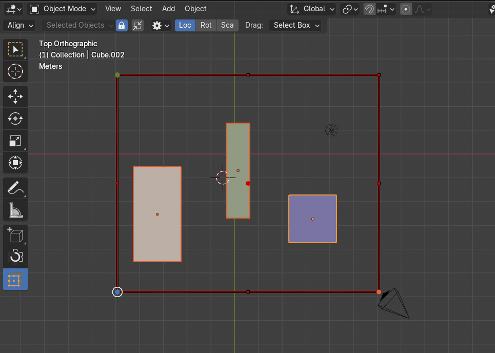
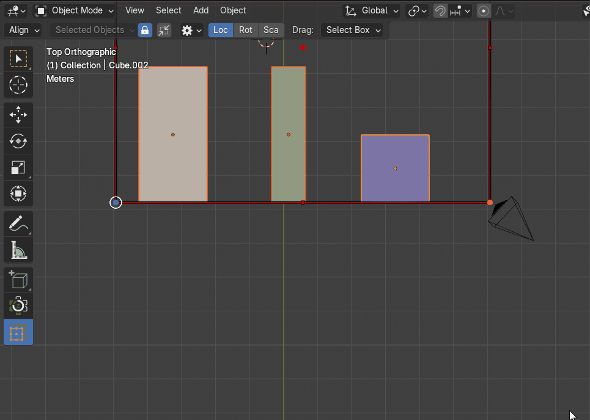
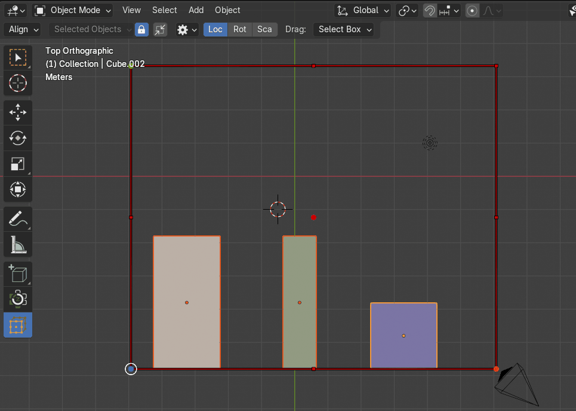
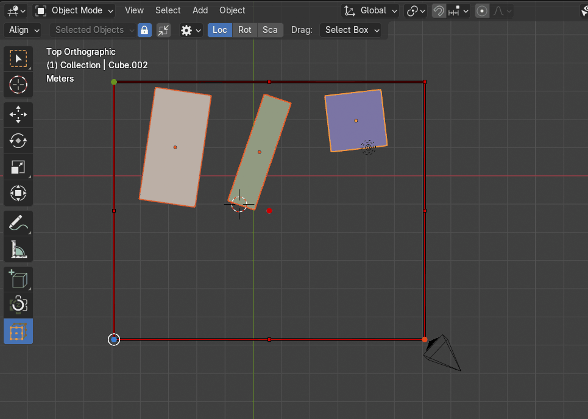
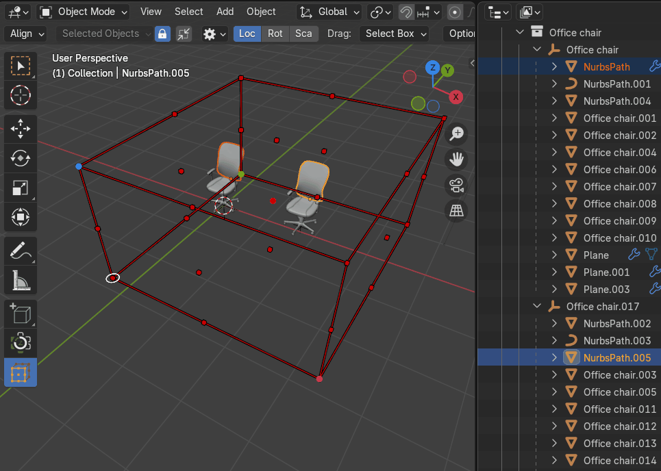

# Align Objects
The Align tool is used to align multiple selected objects so they line up on a specified axis.

## Align By
The **Align By** property determines how objects are aligned relative to their reference points. Users can choose between two alignment options: [**Bounding Box**](#bounding-box) and [**Origin**](#origin).

|  |
|---|
| The **Align By** property |

### Bounding Box
- Objects are aligned based on their bounding box sides.
- The alignment adjusts to the outermost edges of the bounding box, ensuring that objects are positioned relative to their calculated boundaries.
- Ideal for aligning objects using their total selection dimensions rather than individual origin points.

### Origin
- Objects are aligned by their origin point rather than the bounding box.
- The bounding box itself shifts to match the position of the object’s defined origin.
- Useful for precise origin-based alignment, especially in workflows requiring consistency in pivot placement.

## Align Outside
The **Align Outside** option ensures objects are aligned by the outer side of the bounding box cage, rather than the inner boundaries. When enabled, alignment calculations use the external edges of the bounding box as the reference point.

|  |
|---|
| The **Align Outside** property |

## Align To Axis
The **Align To Axis** property controls how objects are aligned when clicking on a bounding box cage  point. This setting determines whether alignment occurs along a predefined axis or directly at the selected point.

|  |
|---|
| The **Align To Axis** property |

## Align Transform Components
The Align Transform Components property determines how objects are aligned based on their transform attributes: [**Location**](#location) and [**Rotation**](#rotation). The alignment operation is applied depending on the selected components, allowing users to control which aspects of an object's transformation are adjusted.

|  |
|---|
| Example to combinate location and rotation |

### Location
Aligns objects by their positional coordinates, ensuring they are placed according to the chosen alignment method.

### Rotation
Matches the rotational orientation of objects based on the specified alignment reference.

**How It Works:**

- Users can enable or disable each component separately.

- If only **Location** is selected, objects align without changing their rotation or scale.

- If **Rotation** is included, the objects match the rotation of the reference alignment.

### Hierarchy Mode
The **Hierarchy Mode** property allows users to align entire object hierarchies by selecting any part of a nested hierarchy structure. Instead of aligning only the selected object, this mode ensures that all related objects (parent and children) are adjusted while maintaining their relative transformations.

|  |
|---|
| The **Hierarchy Mode** property |

**How It Works:**

- Users select **any object** within a parent-child hierarchy.

- The alignment operation is applied to the **entire hierarchy**, adjusting the parent and all child objects together.

- **Relative transformations** such as **position, rotation, and scale** of child objects are preserved, ensuring structural integrity remains intact.
