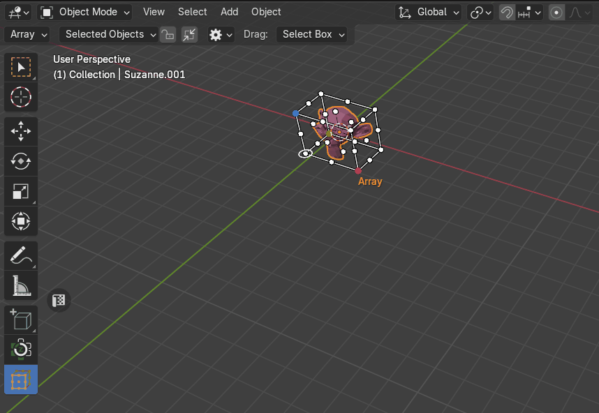
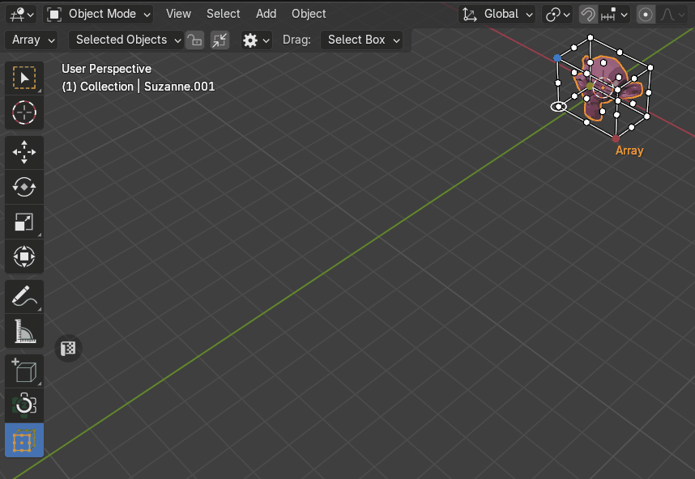

# Objects Array
Creates an array of copies of the base object. Adds a translation equal to the object's bounding box size along each axis, multiplied by a scaling factor, to the offset. X, Y and Z scaling factors can be specified.

|  |
|---|
| Example of Array |

## Margin
The **Margin** property controls the spacing between distributed objects, ensuring a defined gap between each placement.

!!! Note
    Margin is calculated to ensure all objects are fit [the cage](cage_gizmo.md)

|  |
|---|
| The **Margin** property|
