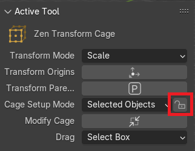
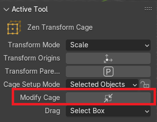
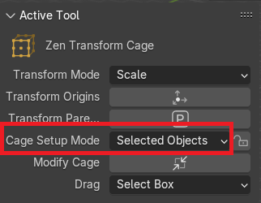
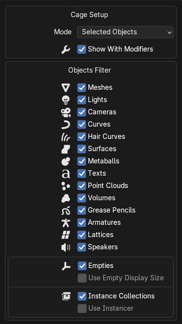
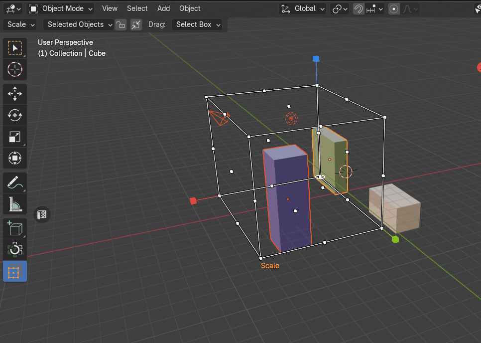
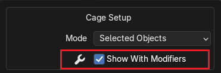
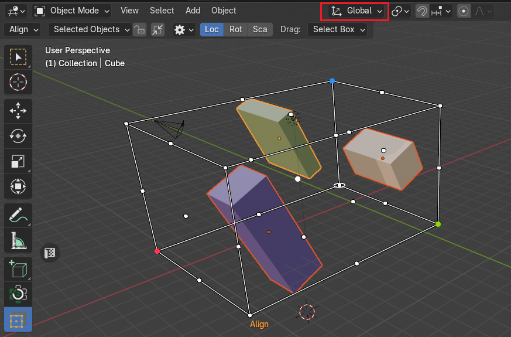
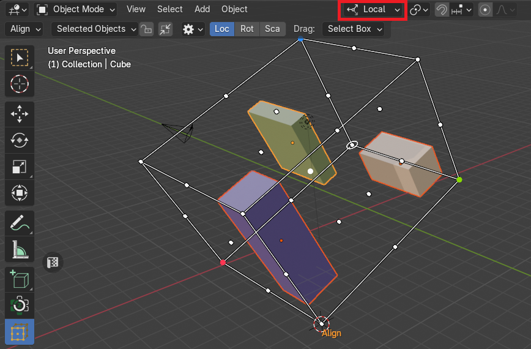

# Zen Cage Transform Gizmo
Zen Cage Gizmo is an object gizmo that allows mouse-controlled transform operations in the 3D Viewport. 

!!! Reference
    **Mode:** &nbsp; Object  
    **Tool:** &nbsp; `Toolbar -> Zen Transform Cage`

|  |
|---|
| Zen Cage Transform Tool |

## Setup
The Setup method allows users to define how the bounding box is created and adjusted. It consists of three distinct modes: [**Dynamic**](#dynamic), [**Locked**](#locked), and [**Manual**](#manual), each catering to different user needs.

|  |  |
|---|---|
| Toggle Lock Setup | Toggle Cage Modification |

### Dynamic
- In this mode, the bounding box automatically adjusts as objects are selected or deselected.
- The bounding box resizes dynamically to fully encompass all selected elements.
- Ideal for fluid selections, where users may frequently modify their chosen objects.

|  |
|---|
| Dynamic setup |

#### By Selected Objects
The bounding box resizes dynamically to fully encompass all selected objects.

|  |
|---|
| Selected-based |

#### By Active Object
The bounding box is determined by a single active object rather than the entire selection.

### Locked
- The user locks the bounding box size, preventing further automatic adjustments.
- Once locked, the bounding box maintains a fixed size, regardless of object selection changes.
- Useful for cases where a specific bounding box size must remain constant.

|  |
|---|
| Locked setup |

### Manual
- Users can manually define and adjust the size of the bounding box.
- Instead of relying on automatic updates, the bounding box dimensions are directly controlled.
- Ideal for precise customization, allowing users to set exact boundaries.

|  |
|---|
| Manual setup |

### Object Type Filter
The Object Type Filter allows users to refine the bounding box creation process by specifying which object types should be included or excluded. This feature ensures greater control over bounding box behavior by filtering out non-essential elements.

|  |
|---|
| Cage Setup Panel |

**How It Works:**

- Users can toggle the filter to exclude specific object types such as lights, text, curves, or other elements from the bounding box calculation.

- When an object type is excluded, those objects will be ignored when determining the bounding box dimensions.

- The filter can be adjusted dynamically, allowing users to modify inclusion settings as needed.

**Use Cases:**

- **Selective Bounding:** Exclude non-geometric elements to focus only on physical objects.

- **Precise Object Grouping:** Ensure text, lighting, or auxiliary components do not influence bounding box calculations.

- **Custom Filtering:** Tailor selection behavior to suit specific workflows.
This feature enhances flexibility, making bounding box creation more intuitive and adaptable to user needs.

|  |
|---|
| Example how to exclude lights and cameras |

### Setup Using or Not Using Modified Object Shape
This feature determines whether the bounding box is built using an object's original geometry or its modified shape after applying a modifier.

|  |
|---|
| Setup using or not using modified object shape |

**How It Works:**

- Blender objects can have modifiers that alter their geometry (e.g., Subdivision Surface, Boolean, Array).
- Users can toggle whether the bounding box should:
    - **Use Modified Shape** – The bounding box is calculated based on the object after the modifiers are applied.
    - **Use Original Shape** – The bounding box is built using the object's base geometry, ignoring modifier effects.

## Transform Orientation
The Transform Orientation determines the orientation of the Zen Cage Gizmo. Changing this orientation can make it easier to perform transformations in the direction you want.

!!! Note
    Only **Global** and **Local** transform orientations are supported!

### Global
Align the transformation cage to world space. The world axes are shown by the Navigation Gizmo in the top right corner of the viewport, as well as the Grid Floor.

|  |
|---|
| Global Transform Orientation |

### Local
Align the transformation cage to the active object’s orientation.

|  |
|---|
| Local Transform Orientation |
