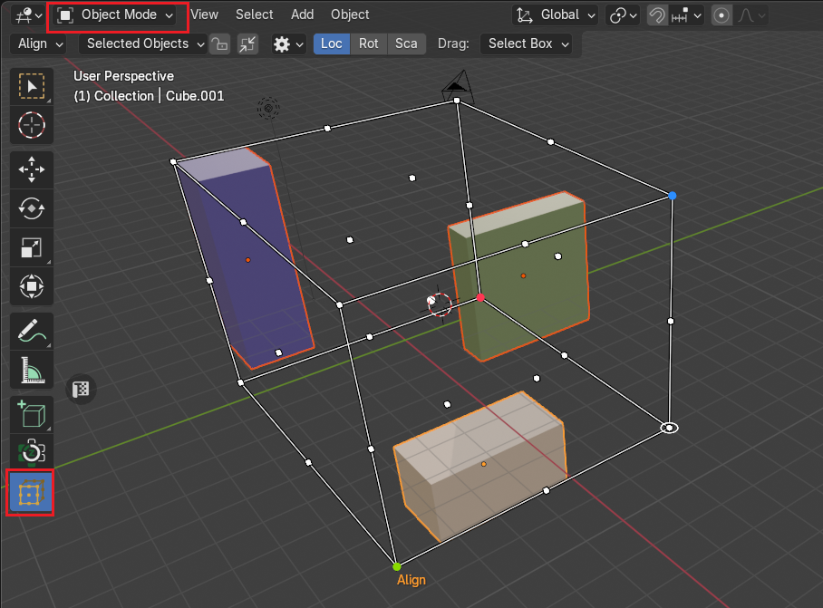
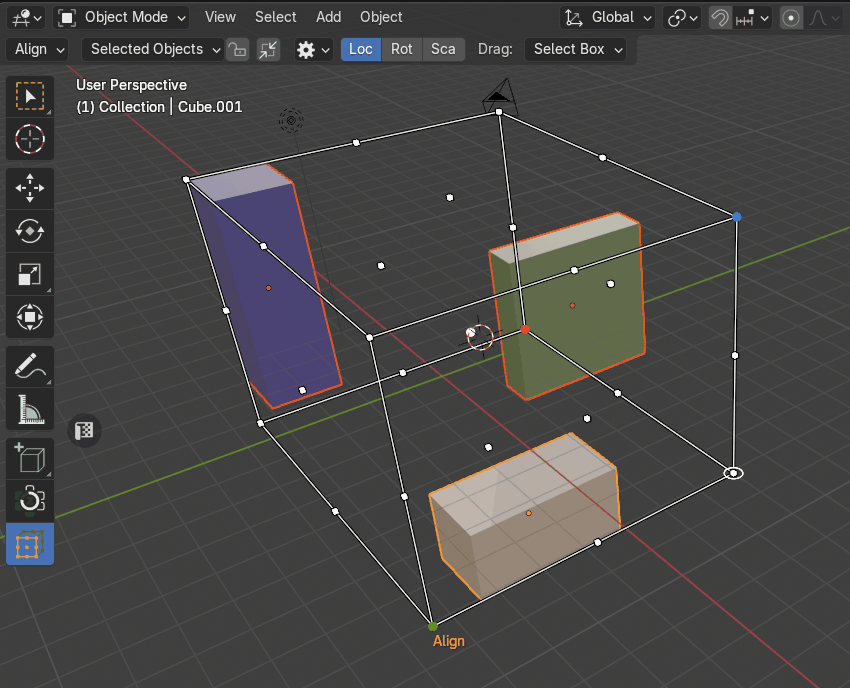
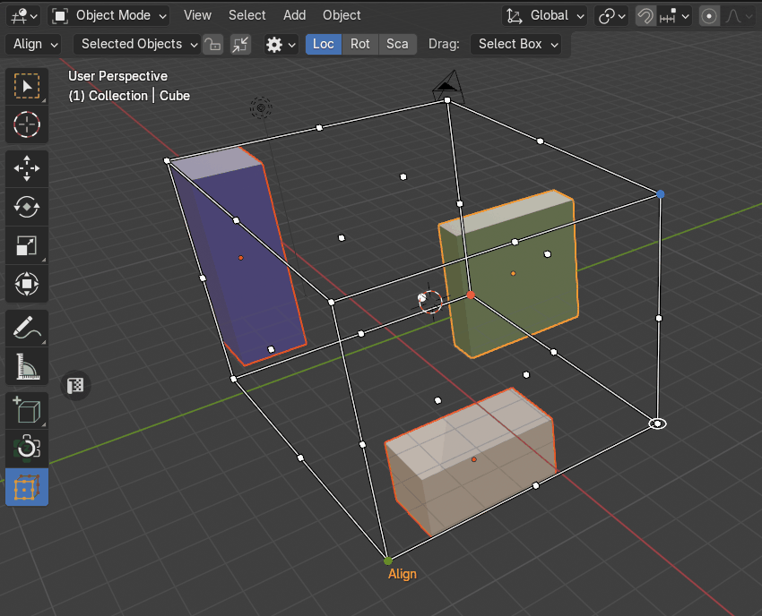
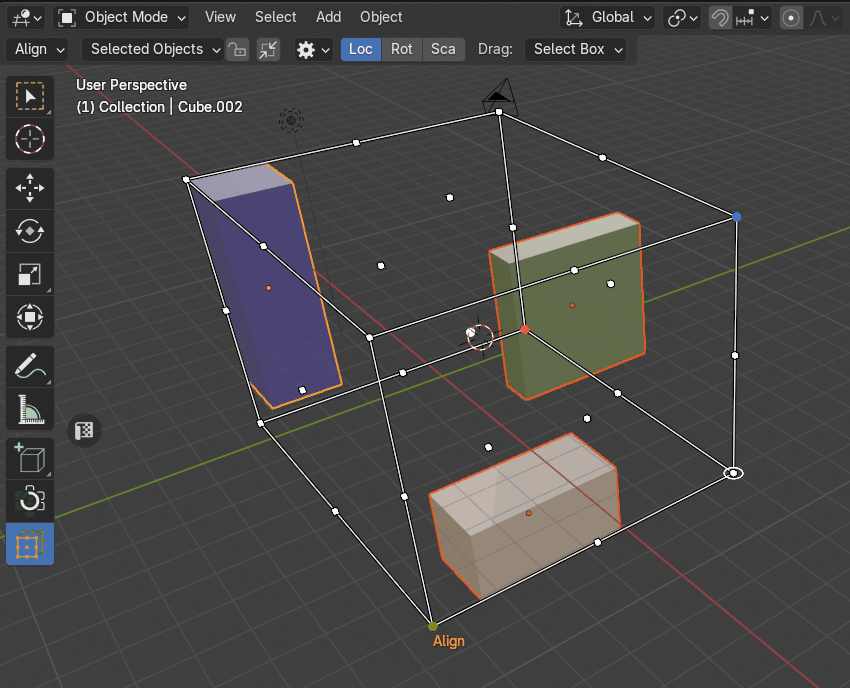

# Zen Cage Transform Gizmo
Zen Cage is an object gizmo allows mouse-controlled transform operations in the 3D Viewport. 

!!! Reference
    **Mode:** &nbsp; Object  
    **Tool:** &nbsp; `Toolbar -> Zen Transform Cage`

|  |
|---|
| Zen Cage Transform Tool |

## Setup

### Dynamic
|  |
|---|
| Dynamic setup |

#### By Selected Objects

#### By Active Object

### Locked
|  |
|---|
| Locked setup |

### Manual
|  |
|---|
| Manual setup |
