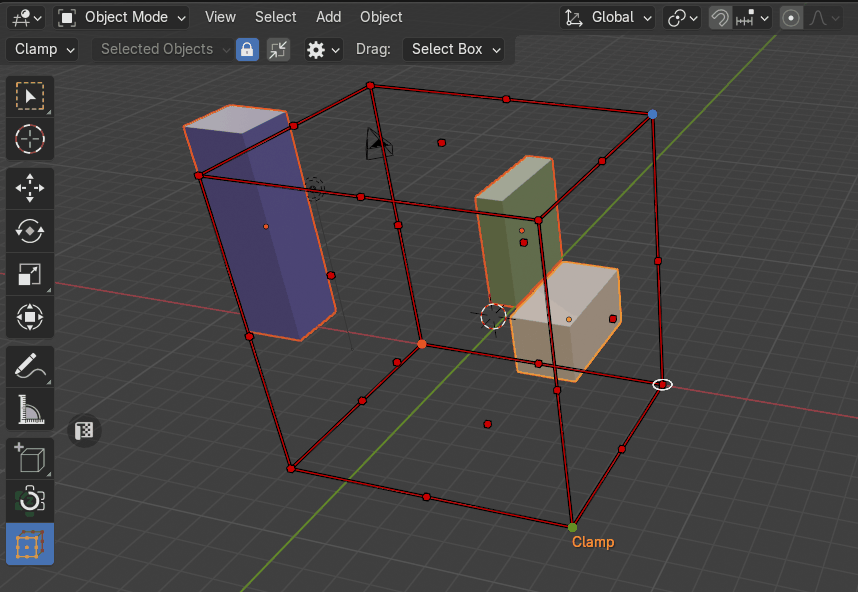
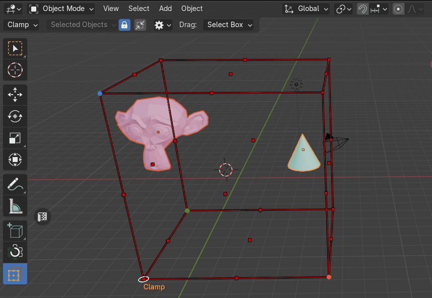

# Clamp Objects
The Clamp mode enables users to conform selected objects to specific boundaries of [the bounding box cage](cage_gizmo.md). This functionality is designed for intuitive spatial manipulation, allowing objects to be scaled and aligned relative to the cage geometry.

|  |
|---|
| Example of Clamp |

**Clamping Behavior:**

- When a handle is clicked, the object is scaled and adjusted to touch the selected face(s) of [the cage](cage_gizmo.md).

- The side of the object opposite to the clicked handle remains stationary.

## Uniform Scale:

- **Enabled**: Maintains the object’s proportions by applying uniform scaling across all axes.

- **Disabled**: Allows non-uniform scaling, adjusting only in the direction of the selected handle.

|  |
|---|
| The **Uniform Scale** property |