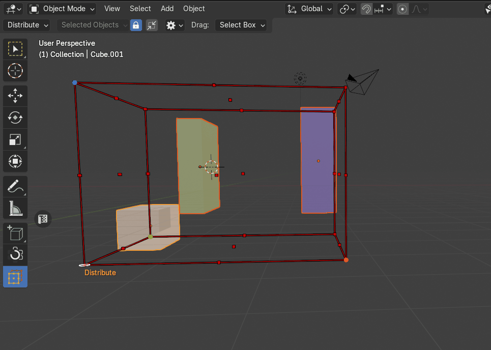
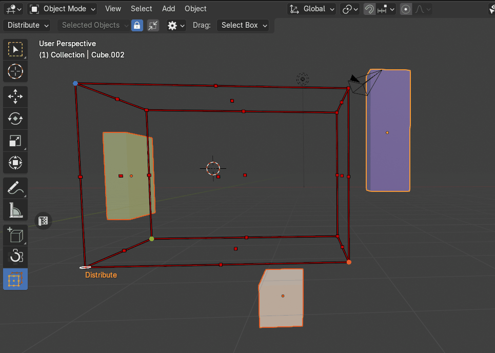
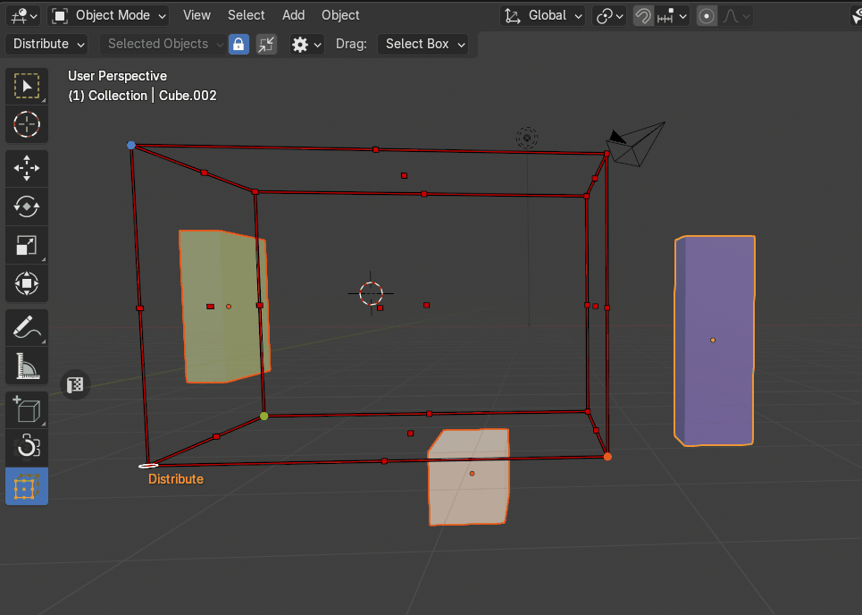
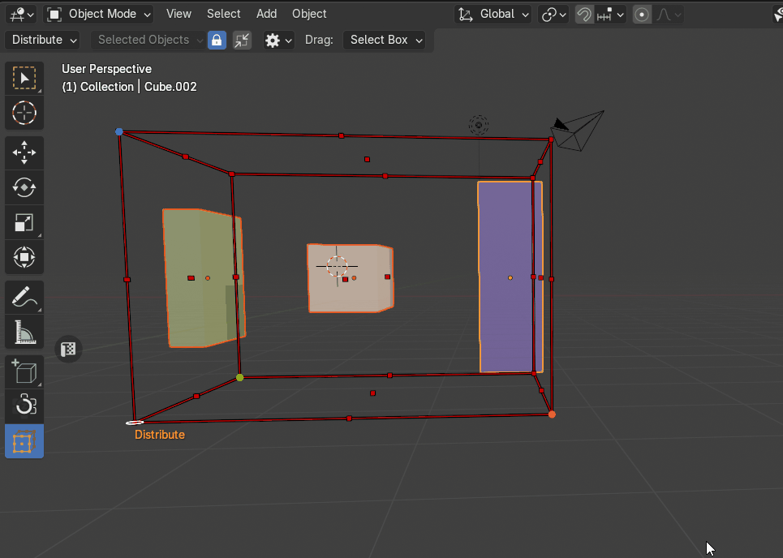
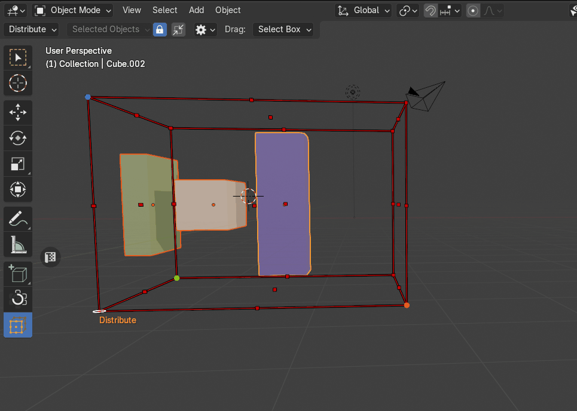
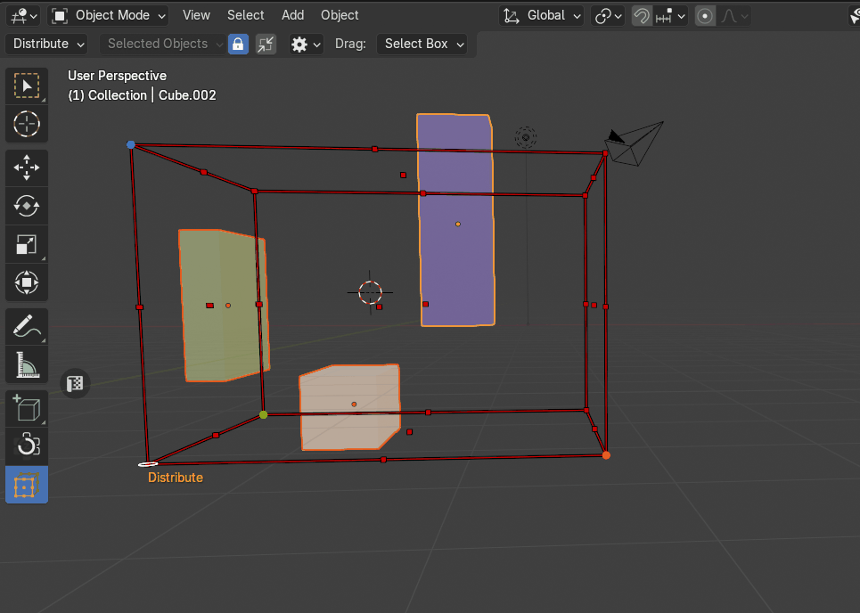
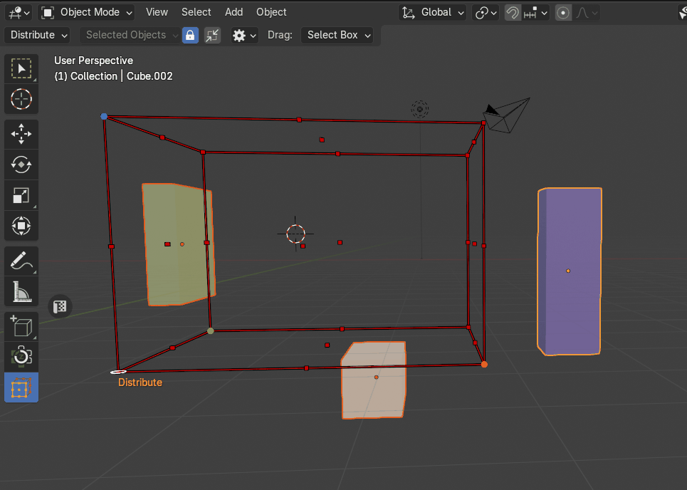

# Distribute Objects
The Distribute Objects tool allows users to arrange objects along a defined axis based on interactions with [the bounding box cage](cage_gizmo.md). The distribution starts from the clicked point and extends towards the opposite point, ensuring controlled placement.

|  |
|---|
| Example of Distribute |

## Distribution Mode
The **Distribution Mode** property determines how objects are spaced and aligned when being distributed along the [cage’s](cage_gizmo.md) axis. Users can choose between three different methods, each offering a unique approach to object placement.

### Keep Distance
Objects are spaced apart, maintaining a set distance between them (defined by [the Margin property](#margin)).

|  |
|---|
| The **Distribution Mode -> Keep Distance** property |

### Bounding Box
Objects are distributed based on their bounding box dimensions, ensuring each one touches the next without extra gaps.

|  |
|---|
| The **Distribution Mode -> Bounding Box** property |

### Origin
Objects are positioned according to their origin points, allowing for precise control over placement while disregarding their physical boundaries.

|  |
|---|
| The **Distribution Mode -> Origin** property |

## Margin
The **Margin** property controls the spacing between distributed objects, ensuring a defined gap between each placement. The margin value is expressed in scene units and adapts dynamically to the unit system used in the project.

|  |
|---|
| The **Margin** property |

**Behavior**

- The specified **Margin** value determines the minimum space maintained between objects during distribution.

- The unit system used in the scene (e.g., **Metric**, **Imperial**) directly affects the margin measurement.

- The default margin value is **0.01 scene units**.

## Fit To Cage
The **Fit to Cage** option determines whether the object should conform precisely to [the bounding box cage's](cage_gizmo.md) limits during distribution.

|  |
|---|
| The **Fit To Cage** property |

## Exclude Axes
The **Exclude Axes** property allows users to restrict object movement along specific axes during distribution. This ensures that objects maintain their original position along excluded axes while still being distributed along the active axis.

|  |
|---|
| The **Exclude Axes** property |
