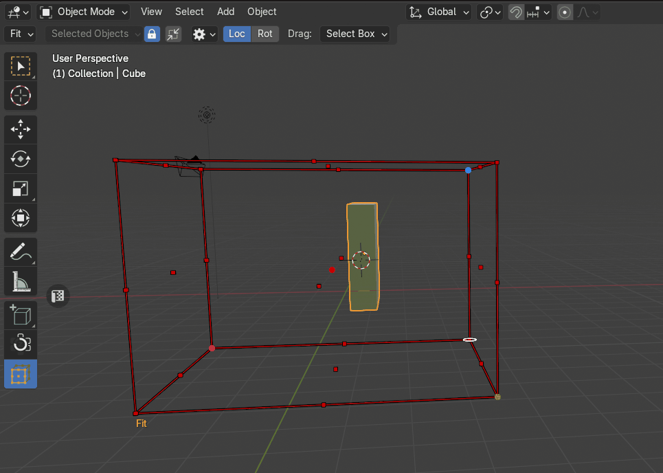
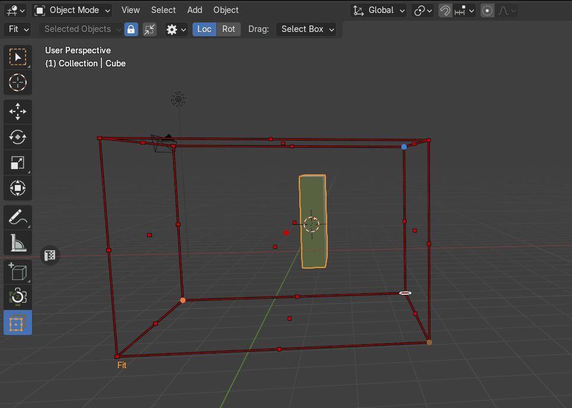
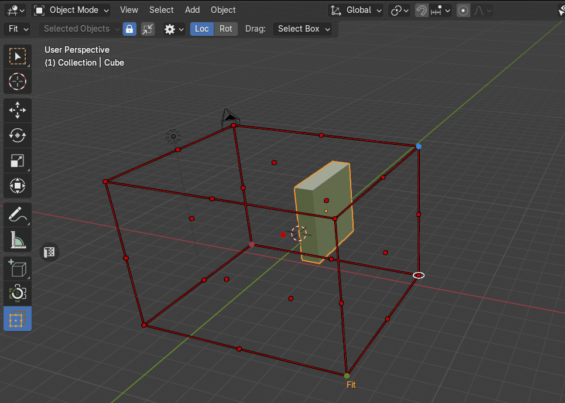
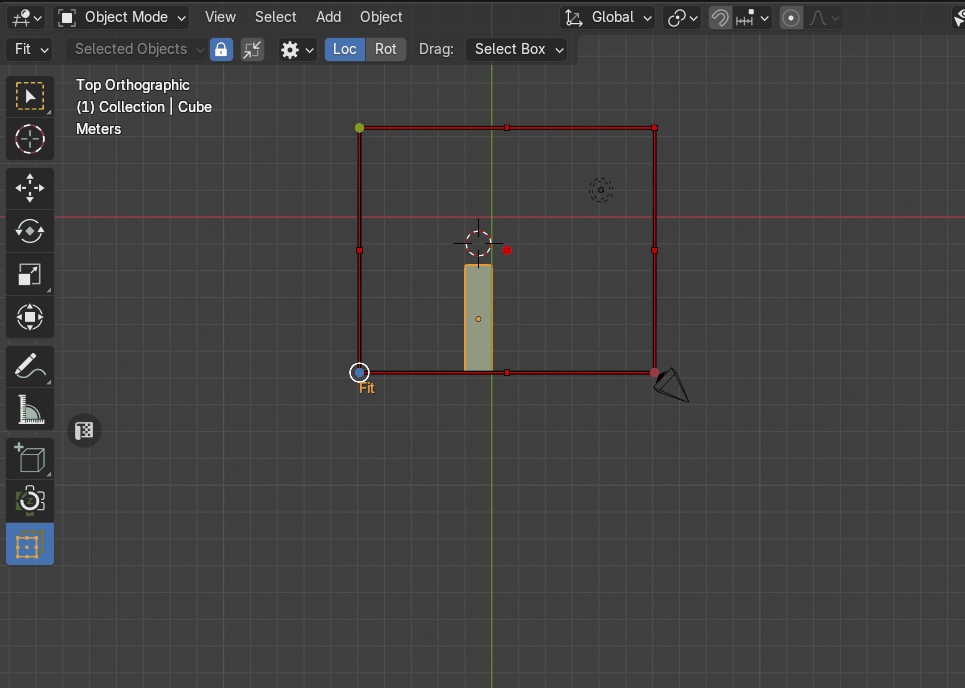
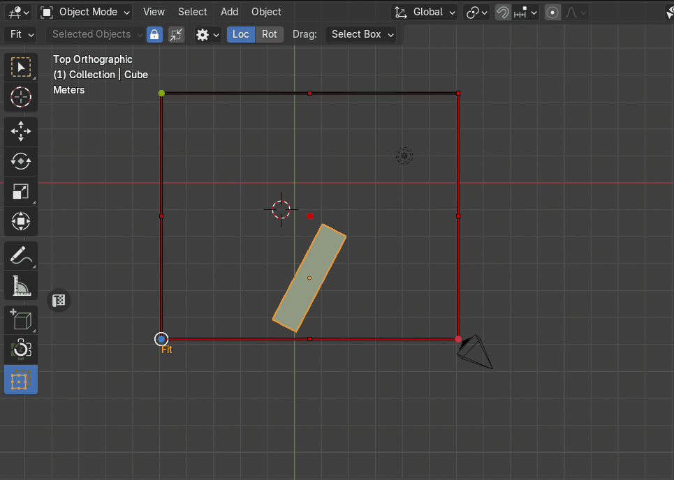

# Fit Objects
The **Fit Objects** transform mode allows users to adjust an object's dimensions to align precisely with a predefined [bounding box transform cage](cage_gizmo.md). This method ensures objects conform to specific spatial constraints efficiently.

|  |
|---|
| Example of Fit |

**Usage:**

1. **Activate Fit Mode:**
    - Navigate to the Zen Transform Cage tool and select Fit mode.

2. **Manipulate the Cage:**
    - Adjust the cage size and position to set transformation boundaries.

3. **Apply Transformation:**
    - Click any control point to adjust the object's dimensions to match the cage’s corresponding bounds.

## Fit Outside
The **Fit Outside** property modifies the transformation behavior by ensuring the object aligns with the outer boundaries of [the bounding box cage](cage_gizmo.md) instead of fitting within it.

|  |
|---|
| The **Fit Outside** property |

**How It Works**

- When Fit Outside is active, clicking a control point adjusts the object to match the external dimensions of the cage.

- The object's size will increase as necessary to ensure it does not enter the cage but rather conforms to its outer limits.

## Uniform Scale
The **Uniform Scale** property controls how an object scales when conforming to the bounding box cage. It determines whether the transformation adjusts proportions independently or maintains the object's original aspect ratio.

|  |
|---|
| The **Uniform Scale** property |

## Scale Mode
The **Scale Mode** property determines how an object's target scale is computed when fitting the bounding box cage. This property offers three distinct scaling approaches, allowing users to control which dimension dictates the transformation.

|  |
|---|
| The **Scale Mode** property |

### Min (Smallest Scale Component)
The object's scale is adjusted based on its smallest dimension. This ensures the object fits the cage while maintaining a conservative scaling approach.

### Mid (Median Scale Component)
The scaling is based on the object's middle dimension, providing a balanced transformation.

### Max (Largest Scale Component)
The object scales according to its largest dimension, ensuring it fully conforms to the cage but may result in more significant resizing.

## Fit Components
The **Fit Components** setting determines which transformation aspects ([**Location**](#location) or [**Rotation**](#rotation)) are applied when fitting an object to the bounding box cage.

|  |
|---|
| The **Fit Components** property |

### Location
Adjusts the object's position to align with the cage while keeping its original rotation.

### Rotation
Modifies the object's orientation to match the alignment of the cage without changing its position.

### Both (Location and Rotation)
If both options are selected, the object is repositioned and reoriented to conform fully to the cage’s layout.
