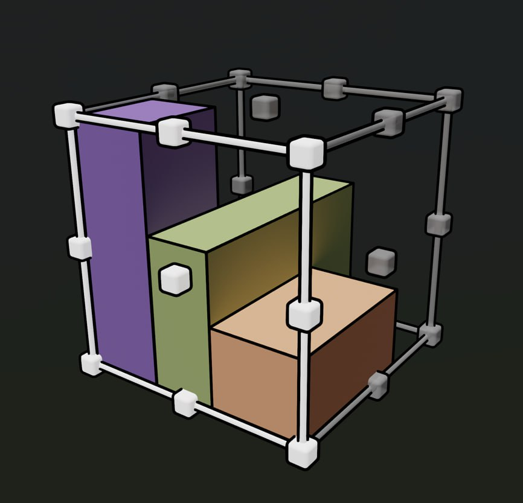

# Zen Cage for Blender 1.0

**Zen Cage** tool is a [bounding box cage gizmo](cage_gizmo.md) around the object(s) which transforms objects from a particular point or axis. The tool works by selecting a point and dragging inwards or outwards to adjust objects transformation accordingly or by clicking on a point depending on the transformation mode. The origin for the transformation will be either the point on the cage or directly opposite from the point selected depending on the transformation mode. Selecting points on the faces of the cage transforms along one axis, selecting points on the edges of the cage transforms along two axes, and selecting points on the vertices of the cage transforms along all three axes.

|  |
|---|
| |

---
## Main Features

- [**Align Objects**](align.md).
- [**Fit Objects**](fit.md).
- [**Distribute Objects**](distribute.md).
- [**Objects Array**](array.md).
- [**Clamp Objects**](clamp.md).
- [**Rotate Objects**](rotate.md).
- [**Scale Objects**](scale.md).

**Enjoy this experience with us!**

 [**Gumroad**](https://sergeytyapkin.gumroad.com/l/zensets) |  [**BlenderMarket**](https://www.blendermarket.com/products/zen-sets) |  [**Discord**](https://discord.gg/wGpFeME)
