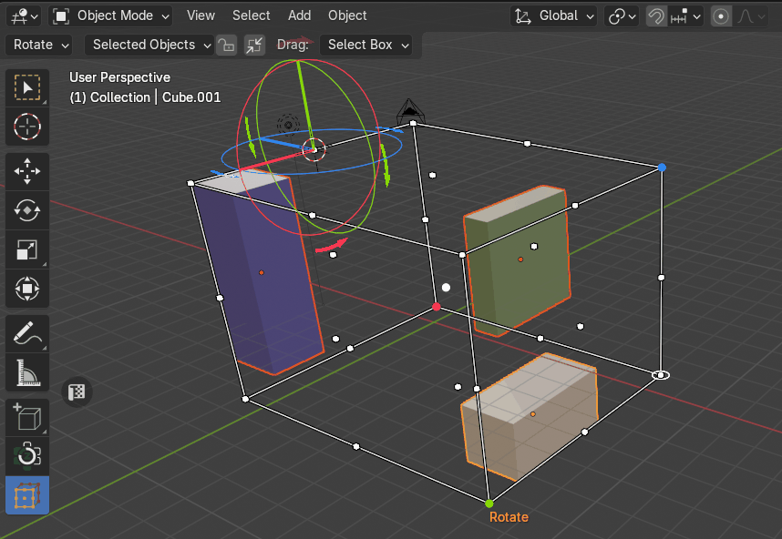
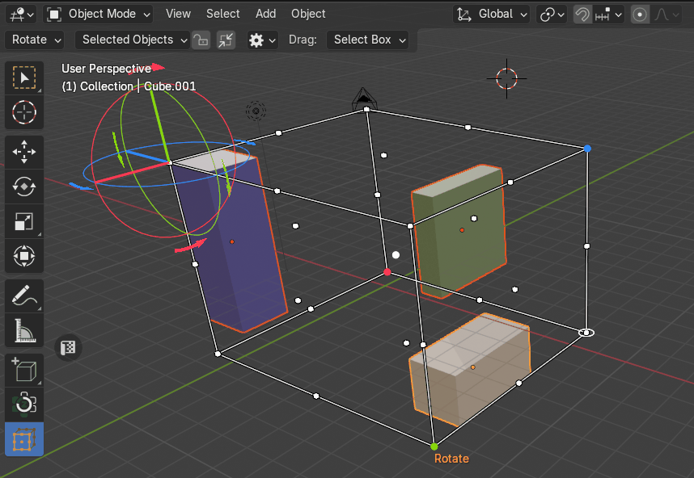
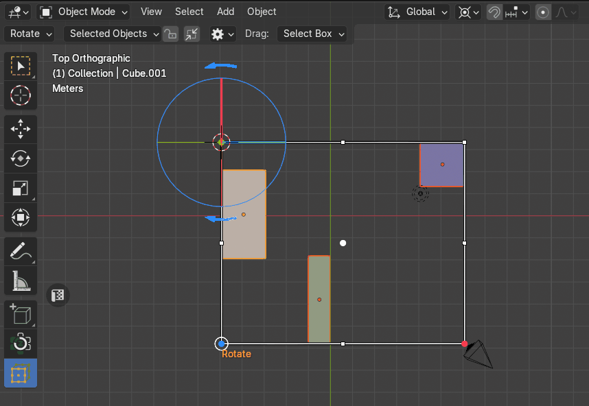
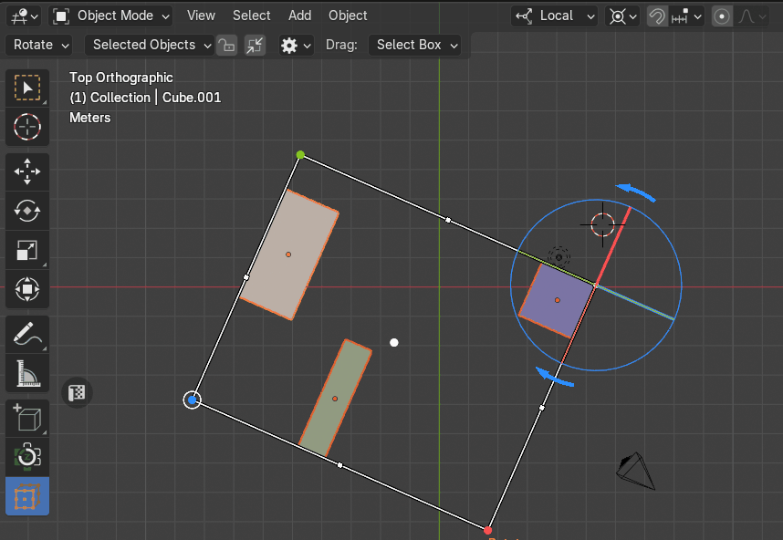
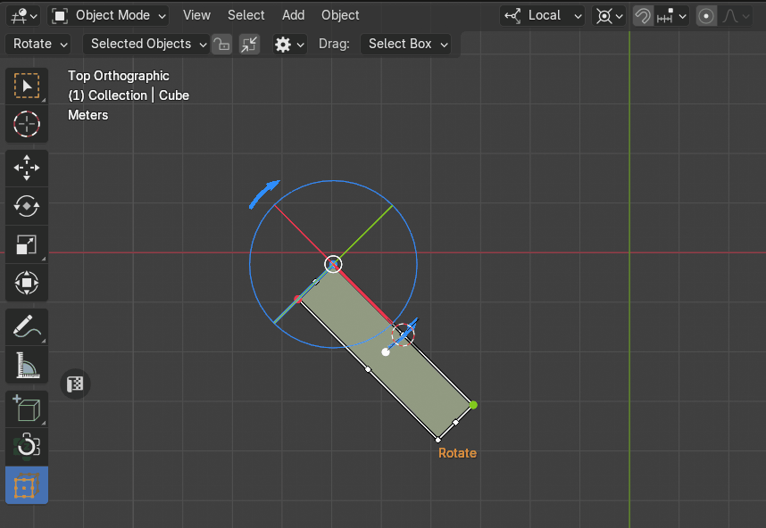
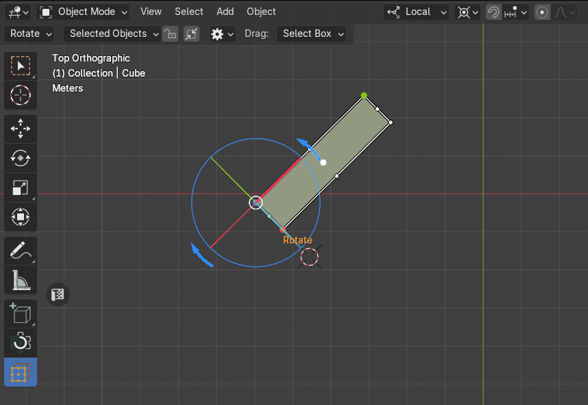

# Rotate Objects
The Rotate Objects mode enables users to rotate selected objects around the Pivot Point. It consists of two submodes: [**Setup**](#rotate-setup) and [**Rotation**](#rotation), which work to define the pivot and apply rotation with precision.

## Rotate Setup
In this mode, users define the pivot point for rotation. By clicking on any point of the bounding box cage, the pivot point is reassigned to that location. Once a pivot is set, a rotation gizmo appears at the selected point, displaying three interactive dials aligned with the X, Y, and Z axes.

|  |
|---|
| Rotate Setup |

### The Sync with 3D Cursor
The **Sync with 3D Cursor** property allows users to synchronize the 3D cursor’s location and rotation with the current rotation pivot point defined in the [Rotate setup](#rotate-setup).

|  |
|---|
| The Sync with 3D Cursor |

## Rotation
### Dial Rotate Gizmo
Users rotate objects by dragging the dials on the gizmo. The rotation is applied to all selected objects, using the designated pivot point as the center.

!!! Note
    Only **Global** and **Local** transform orientations are supported!

#### Global Transform Orientation
|  |
|---|
| [Global](cage_gizmo.md#global) rotation using dial gizmo |

#### Local Transform Orientation
|  |
|---|
| [Local](cage_gizmo.md#local) rotation using dial gizmo |

### Arrow Rotate Gizmo
Each dial also has left and right arrows:

- **`LMB`** on an arrow rotates the object by 90 degrees on the corresponding axis.

    |  |
    |---|
    | Rotation by 90° using arrows |

- **`Ctrl + LMB`** rotates the object by 180 degrees.

    |  |
    |---|
    | Rotation by 180° using arrows |
