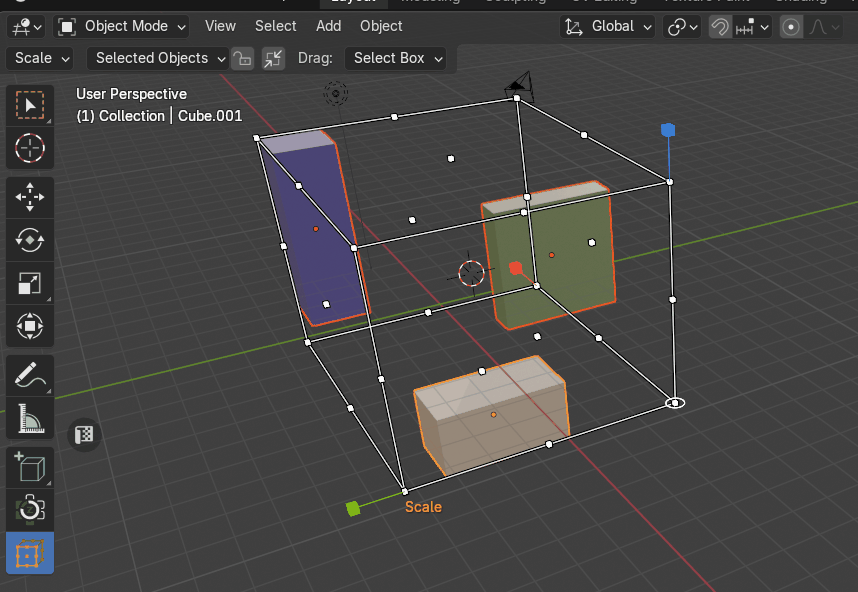
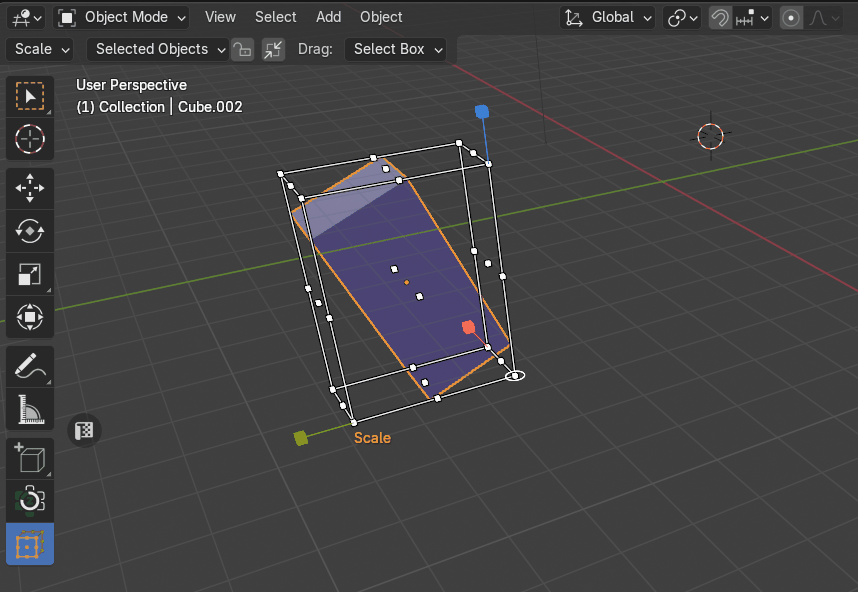
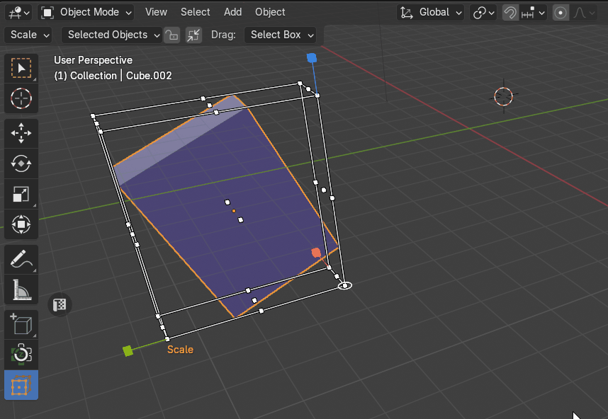

# Scale Objects
The Scale tool is a [bounding box cage](cage_gizmo.md) around the object(s) which scales objects from a particular point or axis. The tool works by selecting a scale point and dragging inwards or outwards to adjust the scale accordingly. The origin for the scale will be from the point on the cube directly opposite from the point selected. Selecting points on the faces of the cube scales along one axis, selecting points on the edges of the cube scales along two axes, and selecting points on the vertices of the cube scales along all three axes.

|  |
|---|
| Example of Scale |

## Transform Orientation
The Transform Orientation determines the orientation of the Zen Cage Gizmo. Changing this orientation can make it easier to perform transformations in the direction you want.

!!! Note
    Only **Global** and **Local** transform orientations are supported!

### Global
Align the transformation cage to world space. The world axes are shown by the Navigation Gizmo in the top right corner of the viewport, as well as the Grid Floor.

|  |
|---|
| Scale Global Transform Orientation |

### Local
Align the transformation cage to the active object’s orientation.

|  |
|---|
| Scale Local Transform Orientation |
