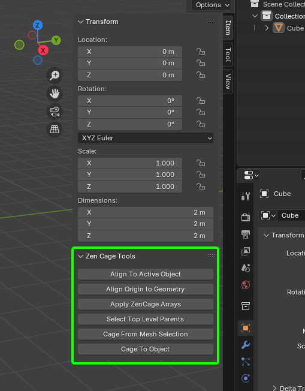
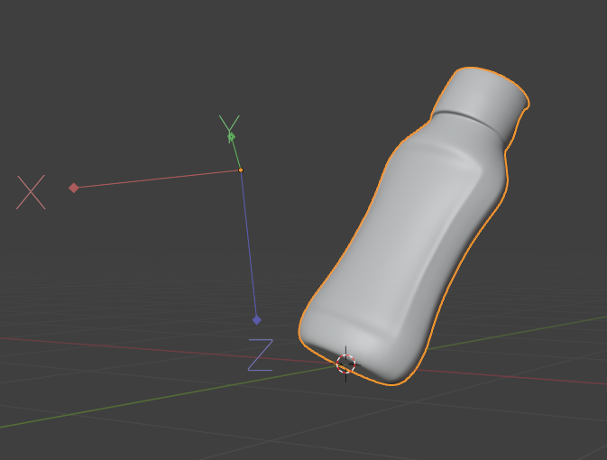
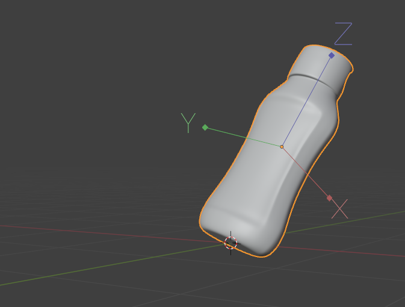
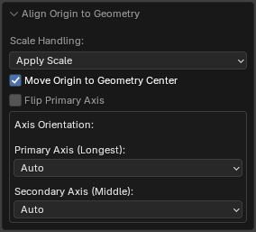
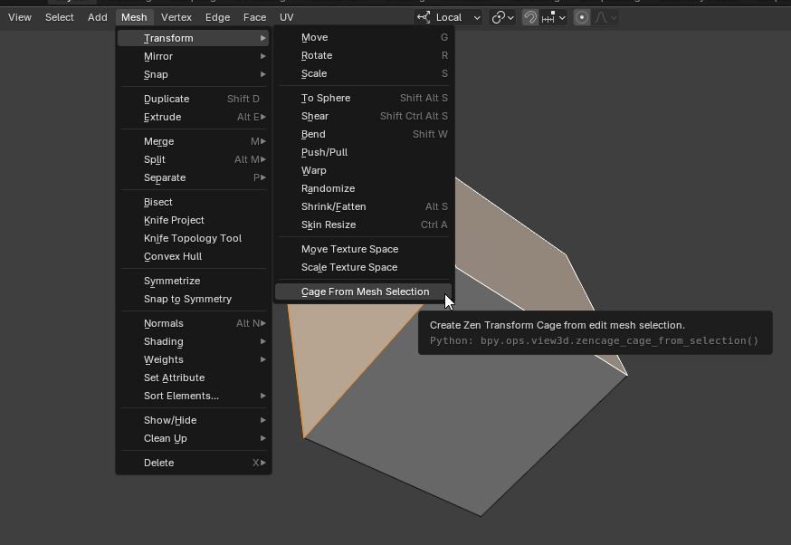
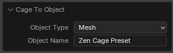

# Zen Cage Tools

The **Zen Cage Tools** panel contains operators that assist with setting up objects, their origins, and other helpful utilities.

You can find the tools in the **N-panel**, inside the **Zen Cage Tools** subpanel.

---

## Align To Active Object

Aligns selected objects to the active object.

Select multiple objects and run the operator.  
All selected non-active objects will have their transformation matched to the active object.

In the settings, you can choose which type of transformation to apply.  
By holding **Shift**, you can select multiple transformation types at once.

- **Align Components** — Choose which transformation components to align:
    - **Location** — Align based on object position.
    - **Rotation** — Align based on object orientation.
    - **Scale** — Align based on object scale.

- **Align Axis** — Choose one or more axes along which to perform the alignment:
    - **X** — X axis.
    - **Y** — Y axis.
    - **Z** — Z axis.

---

## Align Origin to Geometry

Align object Origin to geometry.

This tool analyzes the object's geometry to determine the most suitable origin position and axis alignment.

| Before | After |
|--------|-------|
|  |  |

- **Scale Handling** — Defines how object scale is treated before applying PCA (Principal Component Analysis):
    - **Apply Scale** — Applies the object's scale before running PCA.
    - **Remove Scale** — Resets scale to 1.0 without applying any transformation.
    - **Skip Objects** — Skips objects that are not uniformly scaled.
- **Move Origin to Geometry Center** — Move origin to the center of geometry instead of keeping at object origin.
- **Flip Primary Axis** - Flip the Up Axis (180 degrees).
- **Primary Axis (Longest)** — Sets the axis aligned with the object's longest dimension (1st PCA component).  
  This axis defines the main orientation direction.
    - **Auto** — Automatically selects the longest axis based on object shape (using PCA).
    - **X Axis** — Use the object's local X axis as the primary orientation axis.
    - **Y Axis** — Use the object's local Y axis as the primary orientation axis.
    - **Z Axis** — Use the object's local Z axis as the primary orientation axis.

- **Secondary Axis (Middle)** — Sets the axis aligned with the object's second longest dimension (2nd PCA component).  
  This axis is used to determine the object's forward direction.
    - **Auto** — Automatically selects the middle axis based on object shape (using PCA).
    - **X Axis** — Use the object's local X axis as the secondary orientation axis.
    - **Y Axis** — Use the object's local Y axis as the secondary orientation axis.
    - **Z Axis** — Use the object's local Z axis as the secondary orientation axis.

---

## Apply ZenCage Arrays

Converts an object with modifiers created using [Array](array.md) into a set of instanced objects.  
This operator has no settings — simply confirm the conversion in the dialog box.

---

## Select Top Level Parents
Select top-level parents of the selected objects.

A convenient tool for locating the topmost parent in a hierarchy.

Select any object in the scene and run the operator — the highest-level parent will be selected automatically.  
Supports multiple selected hierarchies at once.

If any hidden objects are found in a hierarchy, a warning will be displayed.

---

## Cage From Mesh Selection

Create Zen Transform Cage from edit mesh selection.

Use this operator when you need to create a cage from the selected mesh elements in Edit Mode.  

For example, you can create a cage from a single room inside a house model to arrange furniture,  
or along a robot’s arm to fit parts precisely.

In Edit Mesh mode, the operator is located in the **Mesh** menu.

---

## Cage To Object

Store cage as object with the same dimensions.

Alongside using [cage presets](cage_gizmo.md/#cage-presets), you can create a special object that matches the size and transformation of the cage.  
This provides a more visual reference, and you can create a new cage from this object at any time.  

Simply select the object and disable **Lock** ([see details](cage_gizmo.md/#locked)).

- **Object Type** - Type of the created object: Mesh or Empty.
- **Object Name** - Name of the created object.
